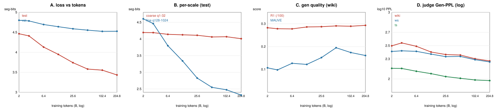

# CADENCE Data Scaling 分析（进行中，2026-09-12）

设置:**2D M8 + CFG(cond_drop 0.1) + HMAR(interp α=0.25)**——即你选定的最优
配置。横轴 = training tokens（OWT2 12.8B unique 反复过,与 BD3 542B/60ep 同
口径的 repeated-token scaling）。base 一条连续训、各 token 点存 checkpoint,
val/test 逐尺度 loss 免费拿;生成质量在有完整链的点测。

## 现有数据（6 loss 点 + 3 生成点；100B/200B 在训,低端采样在跑）

| tokens | test seg-bits | val seg-bits | test coarse(q1-32) | test fine(q128-1024) |
|---|---|---|---|---|
| 2B | 4.465 | 4.802 | 4.195 | 4.606 |
| 3.2B | 4.411 | 4.785 | 4.191 | 4.463 |
| 6.4B | 4.131 | 4.695 | 4.140 | 3.798 |
| 12.8B | 3.948 | 4.641 | 4.126 | 3.342 |
| 25.6B | 3.741 | 4.589 | 4.112 | 2.827 |
| 51.2B | 3.581 | 4.555 | 4.061 | 2.549 |

生成质量（完整链,wiki R1/R2/MAUVE）:12.8B 28.60/4.50/0.122 → 25.6B
28.71/4.61/0.152 → 51.2B 29.06/4.82/0.195。

## 三个定量结论

### 1. 总损失稳定幂律下降,未饱和
test seg-bits 幂律拟合 **loss ∝ tokens^(−0.071)**,2B→51.2B 从 4.465 降到
3.581,**到 4 个 epoch 仍在明显下降**——没有见到平台。val 曲线形状一致
（4.80→4.56,test 系统性低于 val 是 split 难度差,不影响斜率结论）。**含义:
data scaling 收益远未耗尽,最终 scale-up 的 token 预算应显著大于 12.8B**（与
mentor 预判一致；100B/200B 点将确认拐点是否出现）。

### 2. ★分尺度斜率差 19×——CADENCE 特色 signature
把损失按尺度轴拆开,两条曲线斜率天差地别:
- **coarse（语义,q1-q32）:幂律指数 −0.010,近乎水平**（4.195→4.061,总降 3%）;
- **fine（词面,q128-q1024）:幂律指数 −0.193,陡降**（4.606→2.549,总降 45%）;
- **斜率比 ≈ 19×**,且 fine 在 2B 时**高于** coarse（词面最欠训）、在 ~6.4B
  处**穿过** coarse 之下,此后一路走低。

**这是 next-scale prediction 独有、别人物理上画不出的 scaling 结论**:
data scaling 的收益 ~19:1 压倒性流向**细尺度词面渲染**,而**粗尺度语义规划在
2B 就基本学够、几乎不吃数据**。它把"loss 降了"升级成"降在结构的哪一层":
CADENCE 的层级里,语义计划早饱和,规模几乎全用来提升词面渲染。与自适应实验
（难度/信息集中在中细带）、以及段轴/2D 的机制结论完全自洽。

### 3. 生成质量随数据单调升且加速
wiki 三点 R1 28.60→29.06、R2 4.50→4.82、**MAUVE 0.122→0.152→0.195**（分布
保真涨得比 R1 猛,呼应"细尺度吃数据"）——到 51.2B 仍在爬,未饱和。

## 待补（在跑/暂停）
- **100B / 200B**:base 在训（200B 暂停中,ckpt step101200）→ 补 loss 曲线
  右端,确认幂律是否延续到 8/16 epoch 或出现重复数据饱和拐点;
- **低端 2/3.2/6.4B 生成质量**:采样阶段在跑（~1h）→ 补 gen 曲线左端,
  让生成质量也覆盖 2B→51.2B;
- 全部齐后:主曲线加 100B/200B、分尺度图加右端、生成质量图补低端,出终版。

## 对 model scaling 的指示（data scaling 一阶结论）
既然 100M 在 51.2B 仍未饱和,**model scaling 的固定 token 预算不应停在 12.8B
（会饿死大模型）,应取幂律未拐的更大值（≥50B,视 100B/200B 拐点定）**。而
分尺度结论进一步提示:放大模型若主要改善 coarse（语义容量),可能和 data
scaling（主要改善 fine）互补——这是 model scaling 值得专门验证的假设。
