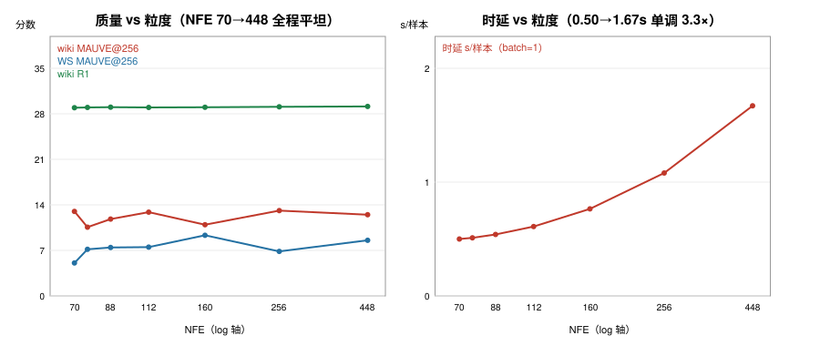

# 2D 解码粒度谱：质量不敏感，adaptive 粒度选择关闭（2026-09-08）

**问题**（mentor 提出）：假设"粒度越细（越逼近 AR）→ 质量越好、时延越差"，
adaptive 粒度选择只有在该假设成立时才值得做。证伪条件：同一训好的 2D 模型上
扫 NFE/粒度谱，若质量对粒度不敏感 → 取最小 NFE，adaptive 关闭。

**实验**：12.8B 2D 最优臂 `b12s2e8`（训练时已见过全部粒度的采样策略，训练
不动），只扫细带 (C,K)∈{C1K1…C16K4}，粗带 seg:0-7:4 与温度谱 p5hot7 冻结；
wiki+WS 各 n=1000、逐行配对（同 prompt 同种子）；时延同一遍跑出（单卡
batch=1，取第二个 benchmark 的生成窗，窗内无模型加载）。C16 超出训练分布
（--chunks 8）作 OOD 探针一并报告。



| 格 | NFE | 时延 s/样本 | wiki R1/R2/M@256 | WS R1/R2/M@256 |
|---|---|---|---|---|
| C1K1 | **70** | **0.50** | 28.94/4.37/13.00 | 31.82/4.61/5.06 |
| C1K2 | 76 | 0.51 | 28.98/4.42/10.57 | 32.02/4.70/7.17 |
| C1K4 | 88 | 0.54 | 29.04/4.47/11.38 | 32.01/4.68/8.59 |
| C2K2（注册格） | 88 | 0.54 | 29.00/4.43/12.26 | 32.01/4.66/6.31 |
| C2K4 | 112 | 0.62 | 28.99/4.47/12.20 | 31.99/4.68/8.33 |
| C4K2 | 112 | 0.60 | 28.97/4.45/13.55 | 31.99/4.65/6.67 |
| C4K4 | 160 | 0.78 | 29.05/4.43/11.45 | 32.07/4.66/8.37 |
| C8K2 | 160 | 0.75 | 28.97/4.39/10.43 | 31.99/4.68/10.29 |
| C8K4 | 256 | 1.08 | 29.07/4.45/13.12 | 31.96/4.62/6.84 |
| C16K4（OOD） | 448 | 1.67 | 29.14/4.45/12.49 | 32.01/4.68/8.56 |

## 结论

1. **质量对粒度完全不敏感**：NFE 70→448（6.4×）全程，wiki R1 全距 0.20、
   R2 全距 0.10；MAUVE 两集均无单调趋势（wiki 10.4~13.6、WS 5.1~10.3，
   在 n=1000 配对噪声带内游走）。连训练分布外的 C16 都平。
2. **时延严格单调**：0.50→1.67 s/样本（3.3×）——细粒度只花钱不办事。
3. **判定：假设不成立 → adaptive 粒度选择关闭**（按预注册的证伪条件）。
   运行点改为 **C1K1@70 NFE、0.50 s/样本**："又快又好"——质量与 448 NFE
   无差、时延为注册格 C2K2 的 92%、为最大格的 30%。
4. 交叉校验：C2K2 谱格与注册枪 `_final12E88` 的 R1/R2 逐位一致
   （29.00/4.43），配对协议工作正常。
5. 机制解读（与全家证据一致）：位置轴的顺序化由残差梯子本身承担（尺度间
   coarse→fine 已是顺序展开），细带内再加 chunk 顺序化没有增量信息——与
   2B 档"2D 天花板 11.5×NFE 只追平"、三轴单变量"段轴独占收益"同一结论的
   第三次独立复现，这次在 12.8B 档 + 配对 n=1000 上。

**对 adaptive 讨论的含义**（mentor 的判断全部兑现）：不存在"难 query 需要
更高 NFE"的可测信号（若存在，谱不会平）；无量化难度标准；离散选择模块
难训——三条理由现在有了数据支撑，优先级正式降为零。

## 附：组件级时延分解（VAR vs MaskGIT，零新增实验）

谱的 10 格里 VAR 前向恒 22 次、粗带采样恒 64 次，唯一变量 = 细带采样次数
6CK——对时延回归即得组件单价（batch=1，单卡 H100）：

```
lat = 467 ms + 3.14 ms × 细带采样次数    （R² = 0.9991，残差 ±18 ms）
```

| 组件 | 单价 | 备注 |
|---|---|---|
| VAR trunk 前向（seq 3071，87M，含 CFG 分支计次） | **19.4 ms/次**（22 次 ≈ 427 ms） | 时延的地板 |
| 细带 MaskGIT pass（尺度 8-10，均长 597） | **3.14 ms/次** | |
| 粗带 MaskGIT pass（l≤128） | ~0.17 ms/次（64 次共 ~11 ms） | 几乎免费 |
| tokenizer 编码+解码 | ~30 ms | 常数 |

**汇率：1 次 VAR 前向 ≈ 6.2 次细带 pass ≈ ~115 次粗带 pass。**

三个推论：
1. `22+88` 的记法在墙钟上有误导性：注册格的 88 次采样合计只占时延 14~21%，
   **VAR 的 22 次占 79%**——MaskGIT NFE 是廉价货币，VAR NFE 是昂贵货币。
   细带 pass 要到 ~136 次才追平 trunk 成本（C8K4 以上才翻转）。
2. FLOP 比预期为 ~21×（87M vs 4.16M），实测只有 6.2× → 采样 pass 是
   launch-bound（固定核开销地板），与 EXP-3 的 KV-cache 结论同机制。
   batch 变大后此比值会向 FLOP 比靠拢（采样头相对更便宜）。
3. **真正的时延杠杆在 VAR 侧**：如 CFG 单分支化（22→11 次）可省 ~215 ms
   = 总时延的 40%；在采样侧省 NFE 几乎不省时间（谱也证明省了不亏质量）。
   交叉验证：ELF-ODE11 同为 22 次前向但 seq 1024，0.30 s → 13.6 ms/次，
   与我们 19.4 ms/次（seq 3071）的比值 1.4×，远小于 FLOP 比 3×——两家的
   batch=1 前向都在 launch-bound 区。

## 尾部延伸：拉到 token=1（2026-09-08 深夜）

| 格 | NFE | 时延 s/样本 | wiki | WS |
|---|---|---|---|---|
| C128K2（OOD） | 1600 | 5.69 | 29.05/4.45/13.75 | 31.79/4.61/6.98 |
| **C=max K=1（每 chunk=1 token，段并行）** | 3648 | 12.23 | 29.01/4.43/11.85 | 32.00/4.65/7.78 |
| C=max K=4（token+段全顺序 = AR 极限） | 14400 | 在跑 | | |

- **质量在 52× NFE 跨度（70→3648）上仍是一条水平线**——包括"每个位置
  单独一个 chunk"的 token 级顺序化。
- **线性时延定律外推 52× 仍准**（预测 11.7 vs 实测 12.23，+4.5%；
  尾部格为 8 分片跑，每分片 batch=1，口径披露）。

**终点（AR 极限）**：C=max K=4（逐 token 且逐段全顺序，NFE 14400，206×）：
wiki 29.07/4.42/13.82、WS 32.07/4.66/6.95、实测 46.0 s/样本（线性预测 45.5，
+1%）。**从全并行到完全 AR 化，质量始终一条水平线；时延线性定律在 206×
外推处仍准**。粒度假设最终封棺；组件分解（VAR 19.4ms / 细带 pass 3.14ms）
获得全谱验证。
