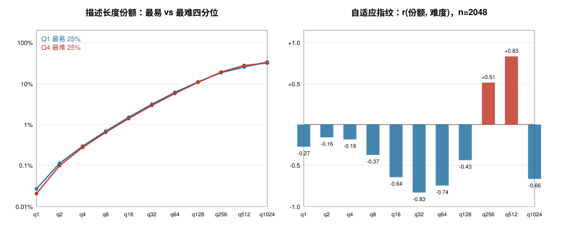
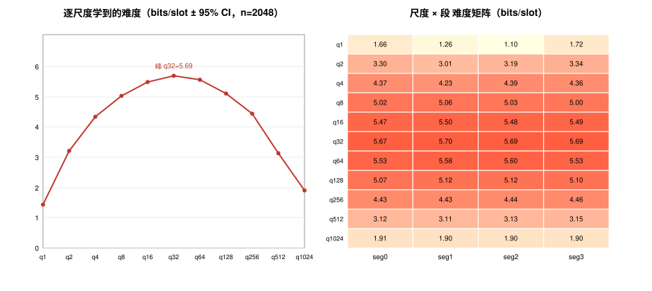

# 内容自适应的信息分配：证据页（2026-09-08，12.8B 2D 臂）

**可主张的命题（及措辞红线）**：CADENCE 的尺度梯子是固定网格（每 1024-token
窗恒 2047 位置 × 4 段），所以"对不同难度的内容用不同数量的 tokens"**不能说**；
成立的是——**槽位固定，信息分配自适应**：每个尺度实际承载的描述长度随内容
难度系统性移动；叠加解码侧 MaskGIT 置信度排序（每样本自适应承诺顺序），
自适应性是内建的。这也正是粒度谱平坦的机制解释：逐 token 级的自适应已在
模型与解码里，全局粒度旋钮没有剩余价值可榨。

**数据**：`tools/per_sample_scale_bits.py` 在部署臂 `b12s2e8` 上对 2048 个
OWT2 val 窗做 teacher-forced 逐样本逐尺度 bits（口径与训练 eval 相同），
难度 = 该窗总描述长度。

## 读数

1. **自适应指纹**（右图，份额-难度 Pearson r，n=2048）：难度升高时，
   描述长度从粗/中尺度（q32 r=−0.83、q64 r=−0.74、q16 r=−0.64）和最细
   渲染尺度（q1024 r=−0.66）**向中细"内容承载带"集中**（q512 r=+0.83、
   q256 r=+0.51）。|r| 高达 0.83 —— 方向极其一致的系统性再分配，
   不是噪声（分位均值差只有 ~2pp，但 2048 窗几乎逐窗同向）。
2. **形状而非水平**：最难四分位相对最易四分位，q512 份额 25.3%→27.6%、
   q1024 33.5%→31.5% —— 是分配的旋转，不是整体抬升。
3. **机制解读**：q1024 是"渲染"尺度（bits 低且与内容难度弱相关），
   q256/q512 是内容信息的主承载带；难文本的额外描述长度几乎全部记账在
   这两级 —— 层级结构自动把"更难的内容"翻译成"中细尺度更多信息"，
   无需任何 learnable 选择模块。
4. 与总体驼峰图（per-scale bits，q32 峰）合读：难度的**平均**分布在中尺度
   驼峰，难度的**变化**却由 q256/q512 吸收 —— 两张图讲的是均值与梯度两件事。

## 建议叙事（给论文/mentor）
"CADENCE 的自适应不在推理超参里，而在表示与解码里：固定网格上，模型把
描述长度按内容难度在尺度间再分配（|r|≤0.83, n=2048），解码按逐样本置信度
自适应排序承诺；因此显式的 adaptive 粒度选择没有剩余价值（粒度谱平坦）。"

## 第二问：不同尺度/段"学到的难度"不同吗？（2026-09-08 补）

**尺度层面：铁证成立。** teacher-forced bits/slot（val n=2048，部署臂）呈驼峰：
q32 峰 5.69 vs q1024 谷 1.90（3×），95% CI 仅 ±0.002~0.04；配对 q32−q1024
Δ=+3.79 bits、t=1356、**2048 窗 100% 同向**。附带发现：部署臂（含 mg 微调）
的粗尺度难度远低于 12.8B 基座（q1: 3.35→1.43、q512: 4.43→3.13）——微调把
难度主要从粗尺度消化掉，驼峰形状保留。

**段层面：统计显著、幅度极小、且只在最粗尺度真实分化。** q1 段间极差
0.62 bits（seg2 易 1.10 / seg3 难 1.72）、q2 0.34；q8 起塌缩到 0.02~0.07
bits（≈0.6% 相对差，t=3~14 仅因 n 大而显著；"最难段"身份跨尺度不一致，
无全局排序）。注意选择偏差披露：每尺度取 max−min 段本身放大小效应。

**合并叙事**：难度的结构性差异几乎全部在**尺度轴**（3× 驼峰）+ 少量在最粗
尺度的段特化；细尺度的四个段在难度上近似对称可互换——这与段轴解码"按置信度
排序承诺、K=S=4 完全顺序化拿满收益"兼容：段的价值在**相关性**（联合分布，
段间耦合），不在边际难度差。
